# Keyboard

## Teclado custom 40% Ortolineal 

### Requerimientos

### Hardware

*   48 Switches (Para este proyecto he utilizado Brown).
*   48 KeyCaps.
*   48 Diodos 1N4148.
*   Arduino Pro Micro ATmega32U4 5V 16MHz.
*   Cables (Utilice los cables de un cable de RED) .
*   Carcasa impresa en 3D.

### Software

*   [QMK](https://docs.qmk.fm/#/newbs) para la programación del arduino.
*   [NohBoard-ReWrite-v1.3.0](https://github.com/raul87011523/void40-ghostseven/tree/custom/NohBoard-ReWrite-v1.3.0) Para emular el teclado.
*   [Always on Top](https://always-on-top-maker.waxoo.com/) para mantener el umulador simepre en primer plano por encima del resto de las app de windows      

### Modelo 3D utilizado

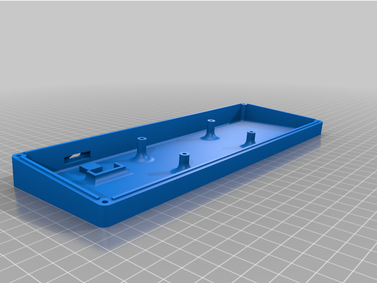

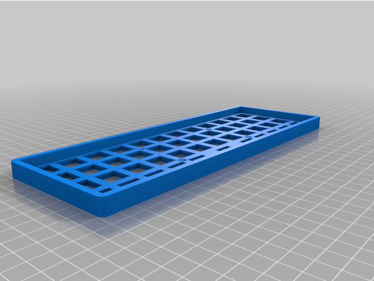

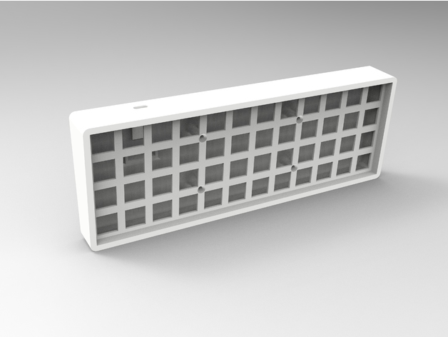

### Imagenes del proceso


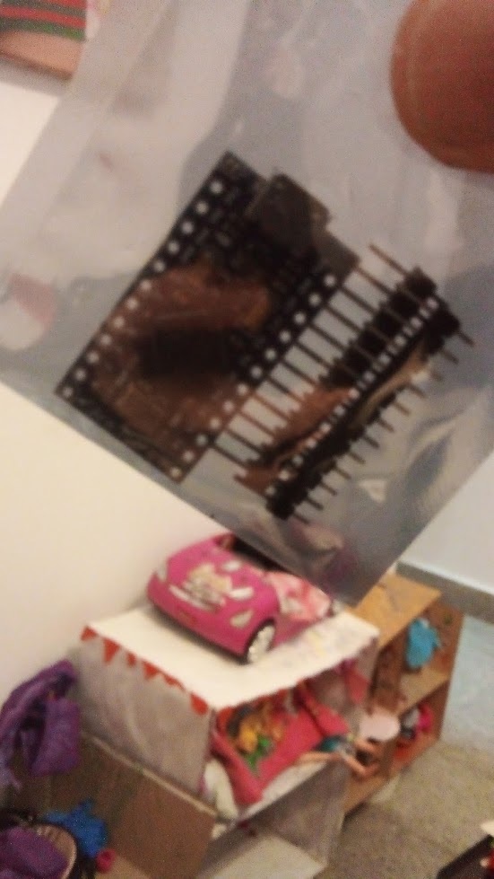

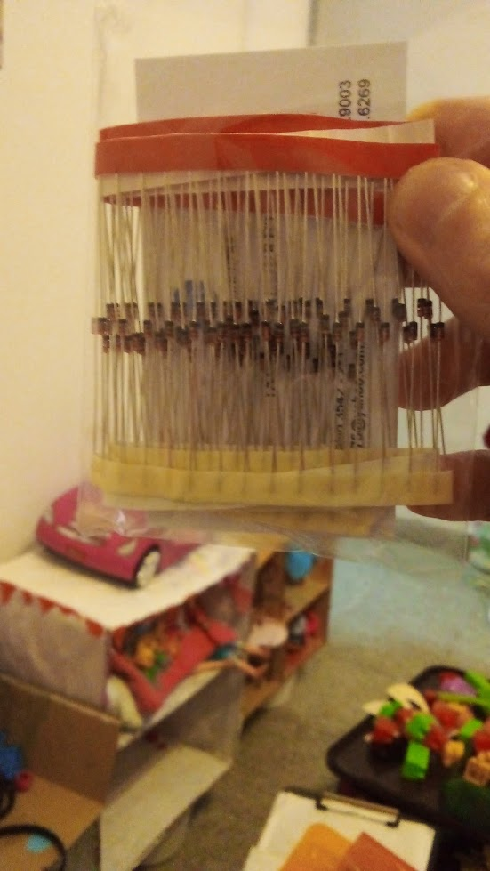

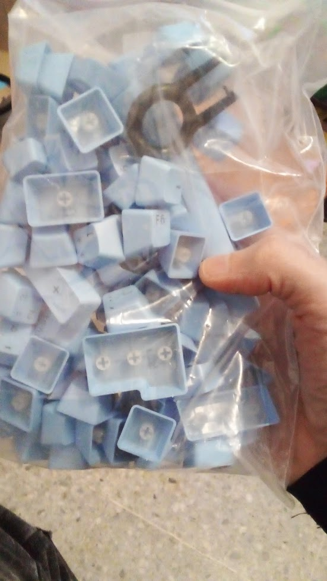

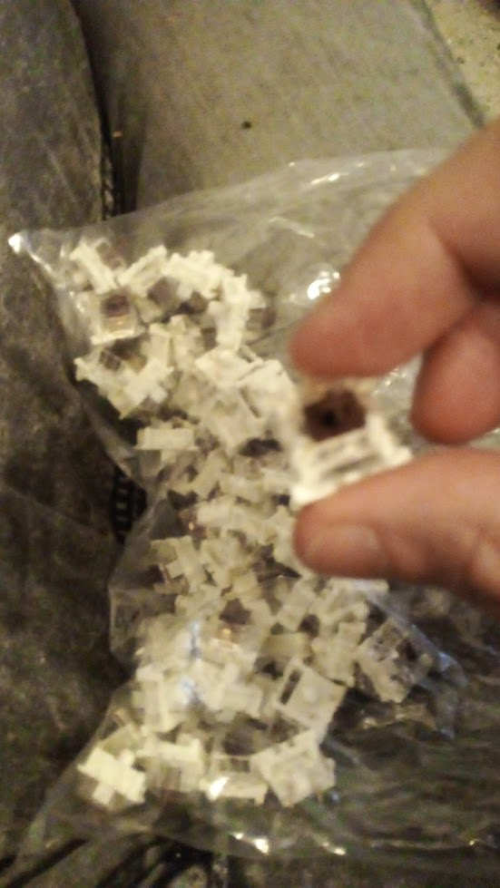


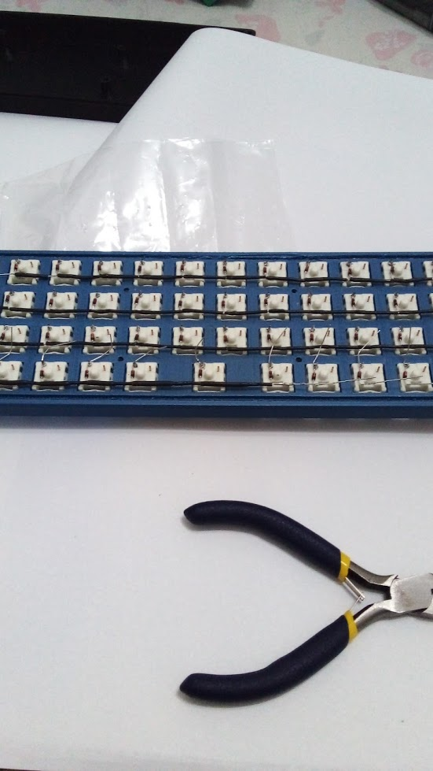

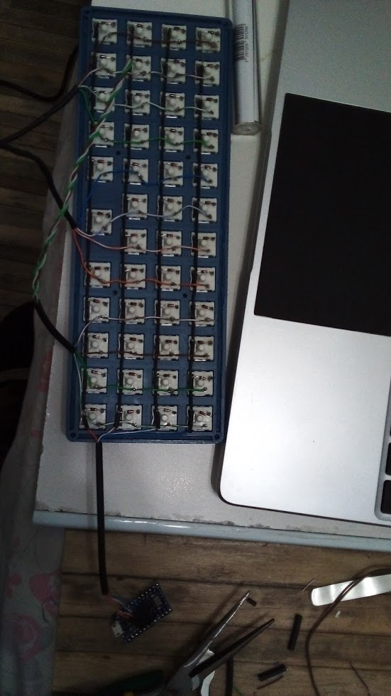

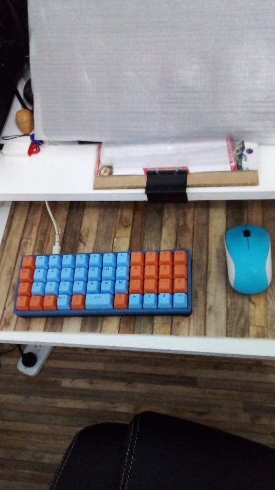


### Instalación de QMK

Usando WSL Ubuntu

```
sudo apt install -y git python3-pip
python3 -m pip install --user qmk
echo 'PATH="$HOME/.local/bin:$PATH"' >> $HOME/.bashrc && source $HOME/.bashrc

```

### Configurando QMK

```
qmk setup
```

El comando anterior descargará el repo [ https://github.com/qmk/qmk_firmware]( https://github.com/qmk/qmk_firmware) en el directorio home del usuario actual en mi caso /home/raul

En la ruta /home/raul/qmk_firmware/keyboards/handwired clone el siguiente repo [https://github.com/raul87011523/void40-ghostseven.git](https://github.com/raul87011523/void40-ghostseven.git) que es un fork del repo [https://github.com/ghostseven/void40](https://github.com/ghostseven/void40). Debo cambiar al branch custom que es donde realice las personalizaciones de las keymaps.

```
cd ~/qmk_firmware/keyboards/handwired
git clone https://github.com/raul87011523/void40-ghostseven.git void40
git checkout custom
```

### QMK - Modificando y creando Layers

Para esta tarea tuve que modificar 3 archivos:

*   void40/default/config.h
*   void40/keymaps/ghostseven/keymap.c
*   void40/ghostseven/rules.mk

**config.h**: Es donde se definen los pines del Pro Micro por filas y columnas en nustro caso hemos usado la distribución:

```
#define MATRIX_ROW_PINS { F6, F7, B1, B3 }
#define MATRIX_COL_PINS { F5, F4, B5, B4, E6, D7, C6, D4, D0, D1, D2, D3 }
```

**keymap.c**: Donde se definieron las keymaps y las macros.

**rules.mk**: Donde se activo la simulación del teclado.

### QMK - Compilación

Una vez terminado de configurar los layers y macros. Podemos compilary generar el archivo Hexadecimal usado para Flashear el Pro Micro

```
qmk compile -kb handwired/void40/ghostseven -km ghostseven
```

El comando anterior nos genera el archivo ~/qmk_firmware/handwired_void40_ghostseven_ghostseven.hex

Para flashear usamos la Herramienta [qmk toolbox](https://github.com/qmk/qmk_toolbox).  La cual solo esta disponible para Windows y Mac.

Una vez abierta la aplicacion:

*   Seleccionar la ubicación del archivo handwired_void40_ghostseven_ghostseven.hex.
*   Conectar el teclado y puentear el RESET y GND del Pro micro (en mi caso le he puesto un switch)
*   Una vez presionado el switch aparecera un mensaje que dice DFU device connected:.. 
*   Presionar el boton Flash.

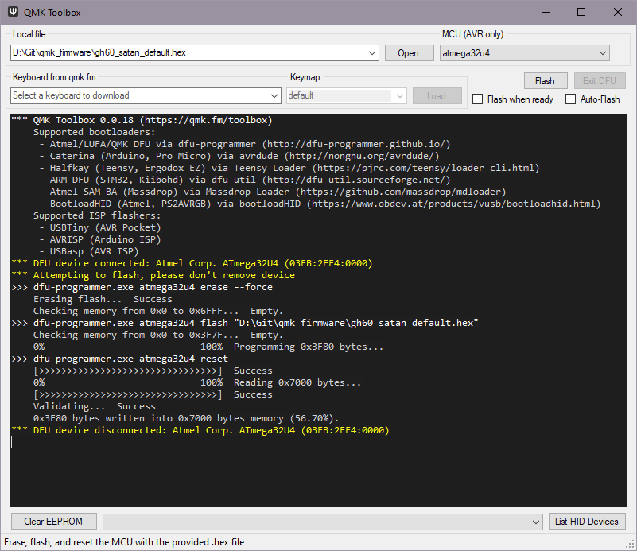


> QMK viene para trabajar con las keymap en ingles. Para lograr las tildes se utilizo el ALt Derecho ó Alt Grant (KC_RALT) y se mapeo en la Tecla Function (Primera columna de la 4ta fila). Para que la Tecla Alt Grant funcione en Windows 10 en las preferencias del lenguage (Preferred Language)
En las opciones del idioma debe seleccionarse Unite State-International (QWERTY)

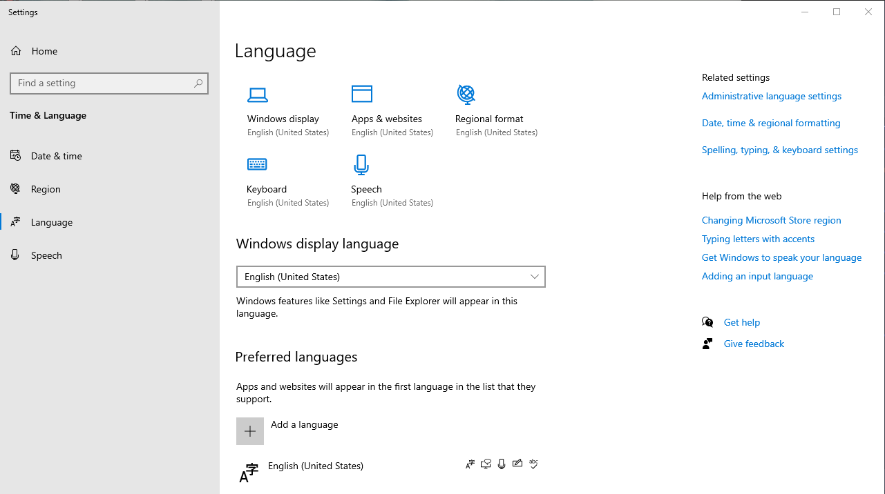

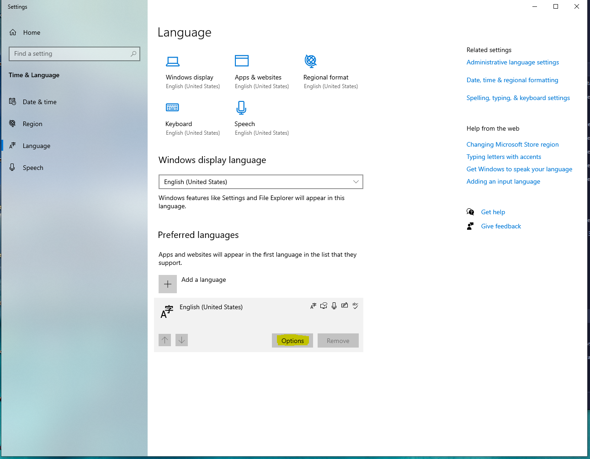

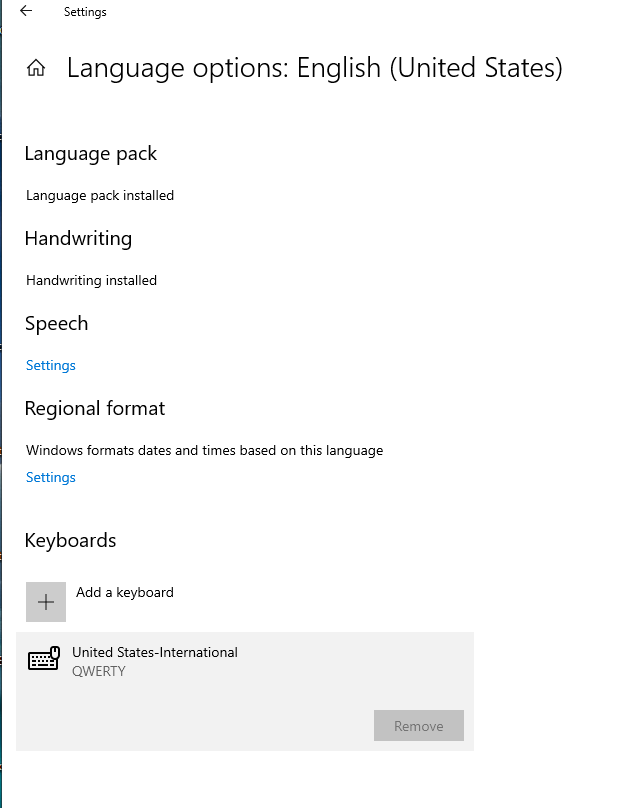


### NohBoard-ReWrite-v1.3.0 y Always on Top

NohBoard-ReWrite-v1.3.0 es un software que te permite diseñar un teclado personalizado y te
muestra en tiempo real las teclas que estan siendo presionadas. Esto es de mucha ayuda en un inicio porque si cuentas con un teclado con muchas layers y macros lo puedes usar de leyenda y orientarte sin tener que mirar el teclado. 

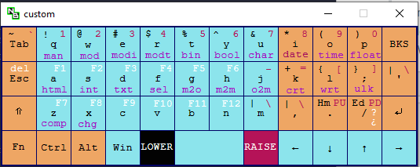 

El único problema que tiene es que no puedes configurarlo para que se sobreponga por encima de cualquier pantalla y ahí es dodne entre "Always on Top" que te permita superponer aplicaciones en primer plano. Para eso solo se debe seleccionar la Aplicación y precionar Ctrl+Espace. 

Always on Top es portable y una vez ejecutado se muestra en la barra de tareas con las iniciales DI.

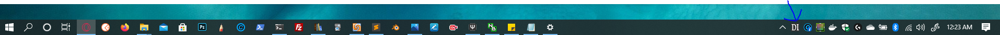 

### Guia utilizada para la construcción 
[3D Printed, Hand Wired 40% Keyboard](./src/guide/guide.md)


Referencias:

[https://www.ghost7.com/3d-printed-hand-wired-40-keyboard/](https://www.ghost7.com/3d-printed-hand-wired-40-keyboard/)

[Modelo 3D](https://www.thingiverse.com/thing:4207020)

[QMK keymaps](https://beta.docs.qmk.fm/using-qmk/simple-keycodes/keycodes_basic)

