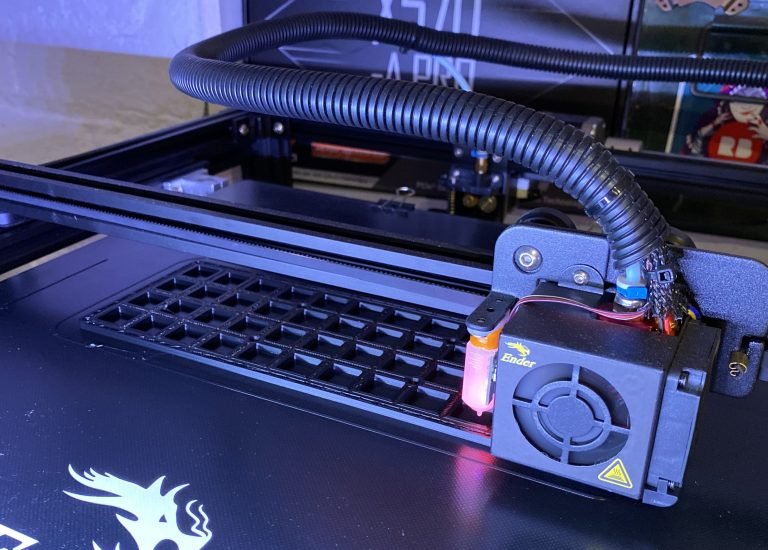
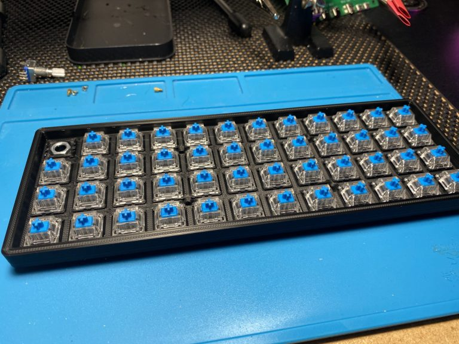

[Blake Drayson](https://www.ghost7.com/)

Mac User – .NET / SWYX Developer – Electronics – IoT

☰ Menu

*   [Blog](https://www.ghost7.com)
*   [About](https://www.ghost7.com/about/)
*   [Contact](https://www.ghost7.com/contact/)

3D Printed Hand Wired 40% Keyboard
==================================

Posted on [27th August 2020](https://www.ghost7.com/3d-printed-hand-wired-40-keyboard/) by [blake](https://www.ghost7.com/author/blake/)

The subject of this blog is a build log, that will cover my build of a 3D printed hand wired 40% keyboard. It will include basic details on 3D printing, hand wiring, general assembly and software programming with QMK along with references to the guides I used.

About a month or so ago I was looking around for a new project (as I frequently do) and I stumbled upon a [mechanical keyboard sub-reddit.](https://www.reddit.com/r/MechanicalKeyboards/) This ended with me in fairly short order, purchasing the parts to build my first keyboard. Skip forward to today and I have just finished building my third full keyboard and three macro-boards. Clearly this hobby is going to be a money sink!

Required Hardware
-----------------

The hardware you will require for this project is as follows

_The required hardware list is a little more daunting than usual as it will require access to specialist equipment (a 3D printer). You could always buy a case and plate to use instead of printing one and then adjust accordingly._

1.  A 3D printer with a build plate that is at least 220mm x 220mm, or alternatively buying a suitable keyboard plate and case.
2.  47 x MX type mechanical keyboard switches, I used [Gateron Blues](https://www.opticboards.com/shop/gateron-switch/).
3.  48 x [1N4148 diodes](https://www.ebay.co.uk/itm/1N4148-Silicon-Switching-Signal-Diode-High-Speed/312788341972?ssPageName=STRK%3AMEBIDX%3AIT&var=611517587138&_trksid=p2057872.m2749.l2649) for the keyboard matrix.
4.  A [EC-11 rotary encoder](https://www.amazon.co.uk/gp/product/B07R8JGHB1/ref=ppx_yo_dt_b_asin_title_o06_s00?ie=UTF8&psc=1), for the volume control.
5.  A [Pro Micro](https://www.ebay.co.uk/itm/Pro-Micro-ATMEGA32U4-Arduino-Compatible-Board-5V-16MHz-Micro-USB/283887665236?ssPageName=STRK%3AMEBIDX%3AIT&_trksid=p2057872.m2749.l2649) controller board.
6.  6 x M3 6-10mm screws to hold the case together (assuming you are using the 3D printed one).
7.  A suitable set of [keycaps for a 40% ortholinear keyboard](https://www.aliexpress.com/item/33050006384.html?spm=a2g0s.9042311.0.0.3da24c4dUTr3b6).
8.  [A grippy knob…](https://www.ebay.co.uk/itm/Aluminum-Sound-Control-Rotary-Switch-Knob-6mm-for-Potentiometer-Volume-Cap/192895920115?ssPageName=STRK%3AMEBIDX%3AIT&var=493058702111&_trksid=p2057872.m2749.l2649)
9.  Suitable wire for building the keyboard matrix, I used a combination of old network cable wire (solid core) and some 26 AWG solid core cable I had from other projects. Any insulated wire will work but solid core is a little easier.
10.  Line wire to go between the microcontroller and the keyboard matrix, you can use whatever wire you like but I highly recommend using [ribbon cable](https://www.ebay.co.uk/itm/10-14-16-20-26-30-34-40-Way-Multi-Coloured-Flat-Ribbon-Cable-Wire-28AWG/264453322487?ssPageName=STRK%3AMEBIDX%3AIT&var=564122490276&_trksid=p2057872.m2749.l2649) as it is flat and easy to work with.
11.  Soldering iron, snips, glue gun etc

3D Printed Hand Wired 40% Keyboard – Printing The Case

References To Guides
--------------------

It is only fair that I reference the guides that helped me make this keyboard. They may be helpful for people reading my guide for use as additional points of reference.

[A modern handwiring guide – stronger, cleaner, easier](https://geekhack.org/index.php?topic=87689.0)

[A Complete Guide To Building a Hand-Wired Keyboard](https://medium.com/cracked-the-code/a-complete-guide-to-building-a-hand-wired-keyboard-9d8c9cc7b041)

Printing A Case
---------------

I wanted as make where possible all the components for the keyboard, ideally 3D printing where I could. I searched around for different 3D printed cases and was originally going to do a split ortholinear keyboard based on the lets split case. However once it was printed I realised there was not a lot of room to hand wire as it was designed for a PCB. After a bit more hunting I found the [Void 40](https://www.thingiverse.com/thing:4207020) a 40% keyboard case and plate that was designed for hand wiring. It really is an excellent case design, by [Victor Lucachi](https://github.com/victorlucachi) who rightly deserves credit for releasing it freely for everyone to use and build on.

You will need to print this case or have it printed for you, additional you will need to also print one of these [EC-11 to MX](https://www.thingiverse.com/thing:3770166) switch plate adapters. This will allow you to easily pop a rotary encoder into the top left switch socket (or any other socket should you desire).

Once you have these printed, you can socket all of your switches and the rotary encoder.

3D Printed Hand Wired 40% Keyboard – Socketed with Gateron blue switches.

Wiring The Keyboard
-------------------

#### Basic principles: Keyboard matrix

To save us from having to wire directly to each switch, which would be laborious and honestly not practical in any way, a keyboard matrix is used instead. This wiring pattern allows us to only need one wire for each row and one wire for each column, dramatically reducing the wiring that needs to go back to a microcontroller.

However there is a trade off, having independently wired switches means that it is easy to know what switches are pressed at the same time without any false positives or unregistered keys (called ghosting). When a keyboard matrix is used we need to add diodes to each key to prevent the black flow of electricity connecting circuits that are not intended. In practice this means a little bit more fiddly soldering but a far more manageable keyboard build. To read more about keyboard matrices and the ghosting effect I have found the following [article](https://www.dribin.org/dave/keyboard/one_html/) very easy to understand and clearly written.

3D Printed Hand Wired 40% Keyboard – Ghosting 🙂

#### Wiring the diodes

We need to add a diode to each switch, we will be wiring to the top left of each switch (my pictures show the keyboard rotated 180 degrees as it was easier to work on).

The diode must be wired so the anode ( + ) is closest to the switch and the cathode ( – ) is furthest away, it is easy to work out which is which on a diode as the cathode has black bar on it.

To make life a little easier and as is recommanded in all the guides I read, you should create a small loop at the anode end and then pop this over the switch connector. The loop helps create a strong connection and makes positioning somewhat easier. You will want to point the tail of the cathode so it runs straight up away from the switch so that you can loop it around the joining row wire you will add later. For example;

3D Printed Hand Wired 40% Keyboard – Adding diodes

Once you have looped all your diodes around the switches make sure you solder and check their connections, also make sure you have soldered a diode to the rotary encoder as well, it needs to be added to the two pin side in the same way as the switches.

3D Printed Hand Wired 40% Keyboard – All diodes soldered to the switches.

#### Adding the row wires

We now need to add the row wires, these are single wires that will run along each row and be soldered to the end of the diodes we just added.

I used insulated solid core wire for this and lined each wire up marking out where it would be in contact with the diode and cutting out the insulation at with a sharp craft knife.

Once you have your wire prepared you can then start soldering it to the diodes in each row, I recommend wrapping the tail wire of the diode around the row wire then soldering, once done you can trim any excess on each diode with wire cutters.

You should start to build up like this.

3D Printed Hand Wired 40% Keyboard – Partial row wiring.

Once you are done your rows should look like this.

3D Printed Hand Wired 40% Keyboard – Full row wiring.

#### Adding the column wires

This is a very similar process to adding the row wiring, we need to run wires down each column joining all second connectors on each switch in that column. For this I used old solid core network cable wires.

Once again measure and trim the insulation at the correct points and to aid with alignment I suggest you create a loop at one end and solder this to the first switch, then run down and solder to the remaining three in each column.

Once done it should look like this.

3D Printed Hand Wired 40% Keyboard – Full row and column matrix

#### Wiring the microcontroller

The major wiring work is now over, all we need to now do is run a wire to each column and each row on the keyboard (plus three to the rotary encoder). These wires will go back to the microcontroller and later be configured in QMK to drive the keyboard.

I used ribbon cable and I highly recommend this, it is flat and easy to run. I did this in strips of four as that fitted nicely in the gaps between rows and columns.

For each row you need to solder a wire to the cathode side (black bar) of the diode (where it joins the row wire) in any one of those rows. For each column you need to solder a wire to any one of the switches (on the non diode connector) in that column. The following picture should make it a little clearer

3D Printed Hand Wired 40% Keyboard – Link wire routing

I ended up with a wiring diagram that links back the following Pro Micro microcontroller pins.

| Pro Micro Pin          | Row                               |
| :----------------------| :-------------------------------- |
| C6                     | 1 – Top row (QWER)                |
| D4                     | 2 – Second row (ASDF)             |
| D0                     | 3 – Third row (ZXCV)              |
| D1                     | 4 – Forth row (Ctl Alt)           |

3D Printed Hand Wired 40% Keyboard – Row wiring table

| Pro Micro Pin          | Column (Left To Right)            |
| :----------------------| :-------------------------------- |
| E6                     | 1                                 |
| D7                     | 2                                 |
| B5                     | 3                                 |
| B4                     | 4                                 |
| F6                     | 5                                 |
| F7                     | 6                                 |
| F4                     | 7                                 |
| F5                     | 8                                 |
| B1                     | 9                                 |
| B3                     | 10                                |
| B2                     | 11                                |
| B6                     | 12                                |

3D Printed Hand Wired 40% Keyboard – Column wiring table

| Pro Micro Pin          | CRotary Encoder Pin         |
| :----------------------| :-------------------------- |
| D2                     | Right most pin of three     |
| GND                    | Center pin of three         |
| D3                     | Left most pin of three      |

3D Printed Hand Wired 40% Keyboard – Rotary encoder wiring table

One you have these all wired up I would recommend you do not fix the microcontroller in place and you do your programming and testing with a bare keyboard. Better to do it this way than assemble it all and then find a problem.

Configuring Firmware & Flashing QMK
-----------------------------------

I am not going to put a detailed guide on how to configure QMK here, you will need a QMK build environment. I suggest you follow this [guide](https://docs.qmk.fm/#/newbs).

Once you have an environment together you can download the [following files](https://github.com/ghostseven/void40) from my github page, these will need to be extracted into the qmk\_firmware/keyboard/handwired directory. These files contain a fork of the code used by the Void40 by [Victor Lucachi](https://github.com/victorlucachi), this keyboard is not currently in the standard QMK base but I have reached out to Victor and it will soon be submitted (once it is live I will update this post to reflect it). The changes from the standard firmware are related to pin assignments and keymaps.

To build the firmware issue the following command

    qmk compile -kb handwired/void40/ghostseven -km ghostseven

The resulting hex file should be flashed to the keyboard using QMK Toolbox. You will need to short the pins between RST and GND on the pro micro to put it in firmware update mode.

The keyboard will have the following layout if you used the above command.

Please ensure you test all the keys and make sure they work, if you have changed the wiring to the controller in any way you will need to edit the config.h file in the ghostseven folder and match this to your wiring layout.

    #define MATRIX_ROW_PINS { C6, D4, D0, D1 }
    #define MATRIX_COL_PINS { E6, D7, B5, B4, F6, F7, F4, F5, B1, B3, B2, B6 }
    
    /*
     * Rotary Encoder Support
     */
    #define ENCODERS_PAD_A { D2 }
    #define ENCODERS_PAD_B { D3 }

Keycaps & Securing The Case
---------------------------

Once you are happy that your keyboard is working and that the wiring is correct you can clip the pro micro into position on the case bottom. You may require a little hot glue to hold it in place. Once you have the two halves of the case together secure the plate to the case bottom with 4 m3 screws. Once these are in place, flip the case over and use four more m3 screws in the corners to tighten the case up. Be careful to not over tighten and split the plastic.

Finally add your keycaps and get clacking.

### Share this:

*   [Click to share on Twitter (Opens in new window)](https://www.ghost7.com/3d-printed-hand-wired-40-keyboard/?share=twitter "Click to share on Twitter")
*   [Click to share on Facebook (Opens in new window)](https://www.ghost7.com/3d-printed-hand-wired-40-keyboard/?share=facebook "Click to share on Facebook")

### Reference
*   [https://www.ghost7.com/3d-printed-hand-wired-40-keyboard/](https://www.ghost7.com/3d-printed-hand-wired-40-keyboard)
